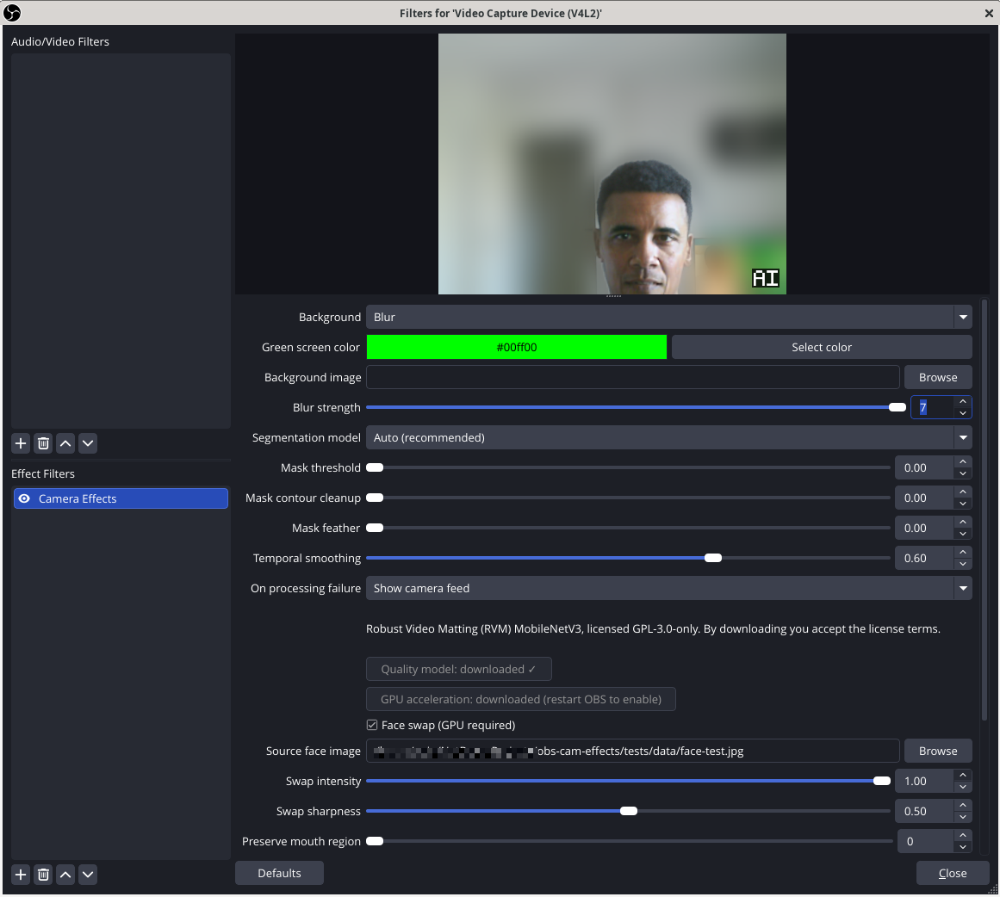

## obs-cam-effects

obs-cam-effects is a plugin for OBS Studio that allows you to apply following 3 filters to your source:

- background blurring effects
- replace background with an image
- deepfake feed with a different face

## Goal

They are already differents solutions for:

- background removal: https://github.com/royshil/obs-backgroundremoval
- deepfake: https://github.com/hacksider/Deep-Live-Cam

but the main difference is that obs-cam-effects is designed to bring all these features together in a single plugin into obs, providing a unified interface and experience for users.

## Usage

- `sudo dpkg -i obs-cam-effects_1.0.0_amd64.deb` or `tar -xvf obs-cam-effects_1.0.0_amd64.tar.gz ~/.config/obs-studio/plugins` .
- Add Camera Effects filter to your source in OBS Studio.

## References

- https://github.com/hacksider/Deep-Live-Cam
- https://github.com/royshil/obs-backgroundremoval
- https://github.com/fangfufu/Linux-Fake-Background-Webcam
- https://github.com/floe/backscrub
- https://github.com/funinkina/openeffects
- https://github.com/Pedrojok01/linux-broadcast
