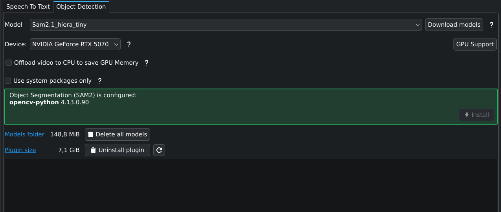
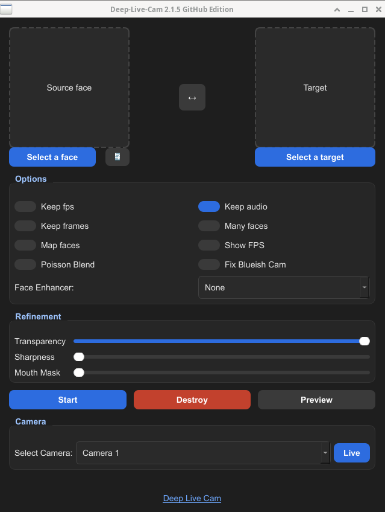

## Hard Requirements

obs-cam-effects is a plugin for OBS Studio that allows you to apply following 3 filters to your source:

- background blurring effects
- replace background with an image
- deepfake feed with a different face

## Brainstorming

1- Kdenlive has a module for background replacement (based on SAM2 https://kdenlive.org/fr/news/releases/25.04.0/ ), what is the difference between it and solutions like https://github.com/royshil/obs-backgroundremoval using MediaPipe,SINet etc...?
Which one is better in terms of performance and quality? We should evaluate both approaches and choose the one that best fits our needs.

2- They are already differents solutions for:

- background removal: https://github.com/royshil/obs-backgroundremoval
- deepfake: https://github.com/hacksider/Deep-Live-Cam

but the main difference is that obs-cam-effects is designed to bring all these features together in a single plugin into obs, providing a unified interface and experience for users.

3- We should explore the possibility of integrating those existing solutions (SAM2 or obs-backgroundremoval prefer the better solution), and Deep-Live-Cam into our plugin to leverage the work already done.

4- We should also consider the performance implications of running multiple filters simultaneously, and ensure that our plugin is optimized for real-time performance.

5- Installation and configuration should be straightforward, with minimal setup required: single installer or package.

## Resources

- https://github.com/hacksider/Deep-Live-Cam
- https://github.com/royshil/obs-backgroundremoval
- https://github.com/fangfufu/Linux-Fake-Background-Webcam
- https://github.com/floe/backscrub
- https://github.com/funinkina/openeffects
- https://github.com/Pedrojok01/linux-broadcast
